<h3><code>naveen@github ~ $ ./contributions.sh</code></h3>

  

<h3><code>naveen@github ~ $ whoami</code></h3>

<table>
  <tr>
    <td valign="top"></td>
    <td valign="top"></td>
  </tr>
</table>

 

<h3><code>naveen@github ~ $ ./links.sh</code></h3>

<!--
  Animated profile art -- three self-contained SVGs, no JS, no token, no
  third-party stats service. The heatmap refreshes daily via GitHub Actions.
  Regenerate the portrait/card only when your photo or details change:
    python scripts/prep_photo.py source-photo.jpg
    python scripts/make_ascii_svg.py
    python scripts/make_info_card.py
  Build details: see BUILD.md
-->
